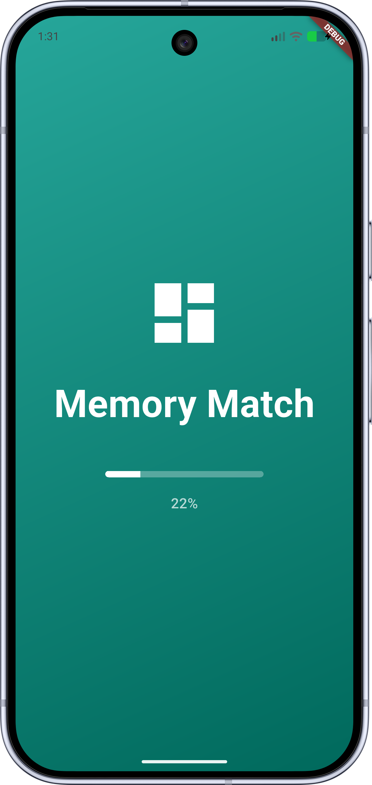
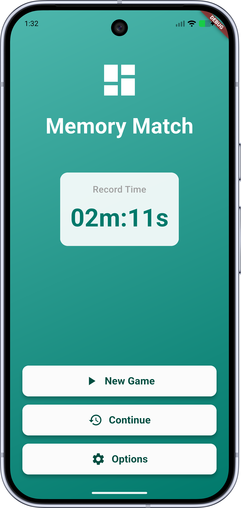
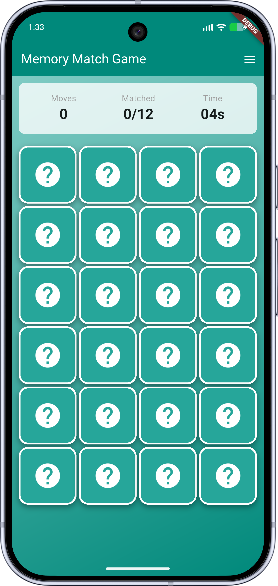
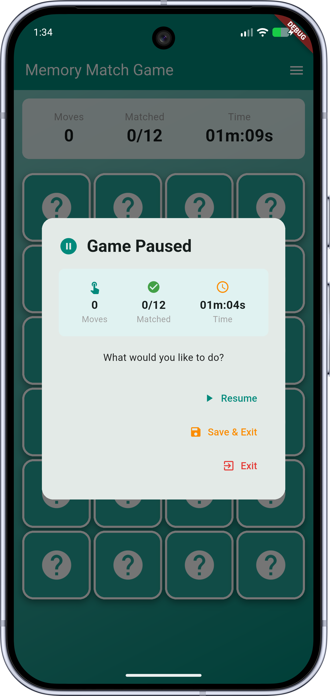
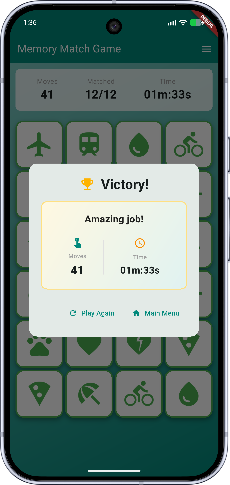
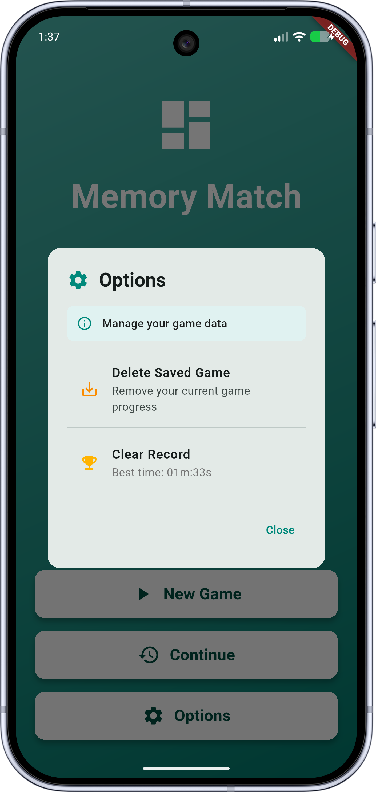

# COMP-5450 Mobile Programming Course, Exercise 2

## Memory Match Game

An interactive memory card matching game built with Flutter, featuring a clean architecture design pattern (MVVM). The game challenges players to find matching pairs of cards within the shortest time possible.

## Features

✨ **Core Gameplay**

- 6×4 grid with 24 cards (12 unique pairs)
- 12 visually distinct icon-based cards (Star, Heart, Pets, Beach, Sun, Cloud, Water, Flight, Train, Bike, Pizza, and more)
- 3D flip animation with smooth transitions
- Real-time move counter and match tracker

⏱️ **Time Tracking**

- Live game timer with adaptive format (seconds/minutes/hours)
- Best time record saved to device
- Time format: `45s`, `02m:30s`, or `01h:23m:45s`

💾 **Game Management**

- Save and resume game sessions
- Clear saved games from options menu
- Clear personal best records
- Persistent storage using SharedPreferences

## Project Structure

### Clean Architecture (MVVM + Clean Architecture)

```
memory_match/lib/
├── layers/
│   ├── domain/                          # Business Logic Layer
│   │   ├── entity/                      # Data models (pure Dart)
│   │   │   ├── memory_card.dart         # Card entity with value, icon, isFlipped, isMatched
│   │   │   └── game_session.dart        # Game state entity (cards, moves, time, pairs)
│   │   │
│   │   ├── constants/                   # Shared constants
│   │   │   └── card_constants.dart      # Card icon definitions used across layers
│   │   │
│   │   ├── repository/                  # Abstract repository interfaces
│   │   │   └── game_repository.dart     # Interface for data operations
│   │   │
│   │   └── usecase/                     # Business logic operations
│   │       ├── generate_new_game.dart   # Create shuffled card grid with icons
│   │       ├── get_best_time.dart       # Retrieve best time record
│   │       ├── save_best_time.dart      # Save new best time
│   │       ├── clear_best_time.dart     # Clear time record
│   │       ├── get_high_score.dart      # (unused) legacy high-score read
│   │       ├── save_high_score.dart     # (unused) legacy high-score write
│   │       ├── delete_high_score.dart   # (unused) legacy high-score delete
│   │       ├── has_saved_game.dart      # Check if game exists
│   │       ├── load_saved_game.dart     # Load saved game state
│   │       ├── save_current_game.dart   # Save game progress
│   │       └── delete_saved_game.dart   # Remove saved game
│   │
│   ├── data/                            # Data Layer
│   │   ├── source/local/
│   │   │   └── local_storage.dart       # SharedPreferences wrapper
│   │   │
│   │   ├── dto/
│   │   │   └── game_session_dto.dart    # Data serialization/deserialization
│   │   │
│   │   └── game_repository_impl.dart    # Repository implementation
│   │
│   └── presentation/                    # UI Layer (MVVM)
│       ├── injector.dart                # Dependency injection setup (GetIt)
│       │
│       ├── splash/
│       │   └── view/
│       │       └── splash_page.dart     # 3-second animated splash screen
│       │
│       ├── main_menu/
│       │   ├── viewmodel/
│       │   │   └── main_menu_view_model.dart  # State: saved game, best time, loading
│       │   └── view/
│       │       └── main_menu_page.dart  # Home screen with record display & options
│       │
│       ├── game/
│       │   ├── viewmodel/
│       │   │   └── game_view_model.dart # State: cards, moves, time, game over logic
│       │   └── view/
│       │       └── game_page.dart       # Game board with pause menu & victory dialog
│       │
│       └── shared/                      # Reusable UI components & state
│           ├── card_widget.dart         # Card with 3D flip animation (GPU-optimized)
│           ├── game_timer_notifier.dart # Timer state management (performance-optimized)
│           ├── menu_button.dart         # Styled menu button
│           └── hud_bar.dart             # Game stats display (moves, time, pairs)
│
└── main.dart                            # App entry point with theme config
```

## Architecture Explanation

### **Domain Layer**

- Contains business logic independent of UI or frameworks
- Defines entities (pure Dart objects)
- Abstract repository interfaces
- Use cases that encapsulate specific business operations

### **Data Layer**

- Implements repository interfaces
- Handles data persistence (SharedPreferences)
- Contains DTOs for serialization/deserialization
- Bridges between domain entities and local storage

### **Presentation Layer (MVVM)**

- **ViewModels**: Extend `ChangeNotifier` for reactive updates
  - Manage UI state (cards, game progress, timers)
  - Execute business logic through use cases
  - Notify listeners when state changes
- **Views**: Stateless/Stateful widgets consuming ViewModel state
  - Use `ListenableBuilder` for reactive rebuilds
  - Handle user interactions
  - Display UI based on current state

### **Dependency Injection**

- GetIt service locator manages all dependencies
- Configured in `injector.dart`
- Singleton repositories and local storage
- Factory-created use cases and ViewModels

## Setup & Installation

### Prerequisites

- Flutter SDK (version 3.11.5 or higher)
- Dart SDK (included with Flutter)
- iOS Simulator or physical iOS device (for testing)
- Android Emulator or physical Android device (optional)

### Step 1: Install Flutter

```bash
# On macOS with Homebrew
brew install flutter

# Verify installation
flutter doctor
```

### Step 2: Clone or Navigate to Project

```bash
cd comp-5450-exercise-2/memory_match
```

### Step 3: Install Dependencies

```bash
flutter pub get
```

### Step 4: Verify Setup

```bash
# Run static analysis
flutter analyze

# Check environment
flutter doctor
```

## Running the Application

### Option 1: Run on iOS Simulator

```bash
# Start simulator (if not already running)
open -a Simulator

# Run the app
flutter run

# Or specify device
flutter run -d <device_id>
```

### Option 2: Run on Android Emulator

```bash
# Start emulator first, then:
flutter run
```

### Option 3: Run on Physical Device

```bash
# Connect device via USB, enable USB debugging
flutter run

# Or specify device
flutter run -d <device_id>
```

### Option 4: List Available Devices

```bash
flutter devices
```

### Hot Reload During Development

While the app is running, press `r` to hot reload or `R` for hot restart:

```bash
flutter run
# Press 'r' to reload
# Press 'R' for restart
# Press 'q' to quit
```

## Testing

### Run Tests

```bash
# Run all tests
flutter test

# Run specific test file
flutter test test/widget_test.dart
```

### Static Analysis

```bash
# Check for linting issues
flutter analyze
```

## Game Instructions

### Complete Gameplay Walkthrough

#### 1. **Splash Screen - Game Startup**

<p align="center">
  
</p>

When you launch the app, you'll see the splash screen featuring:

- **Game Title**: "Memory Match" in large white text
- **Icon**: Dashboard icon symbolizing the game
- **Progress Bar**: Animated loading bar that fills over 3 seconds

The splash screen automatically transitions to the main menu after 3 seconds. This gives the app a polished, professional first impression.

---

#### 2. **Main Menu - Game Selection & Records**

<p align="center">
  
</p>

The main menu is your hub for all game activities:

**Header Section:**

- Game title and dashboard icon at the top
- Takes up the upper portion of the screen

**Record Display:**

- Shows your best time if you've completed a game
- Displays in the format: `45s`, `02m:30s`, or `01h:23m:45s`
- Presented in a white card with rounded corners and shadow
- Gray label "Record Time" above the best time in bold

**Game Buttons (Lower Section):**

- **New Game** (Play Arrow Icon): Start a fresh game with all cards unmatched
- **Continue** (Restore Icon): Resume your previous game if one is saved
  - Only appears if a saved game exists
- **Options** (Settings Icon): Access game settings
  - Delete Saved Game option
  - Clear Record option (reset your best time)

---

#### 3. **Game Board - Active Gameplay**

<p align="center">
  
</p>

Once you start a game, you'll see the main game board:

**Header Bar:**

- **Game Title**: "Memory Match Game" in white text
- **Menu Icon**: Hamburger menu button (three horizontal lines) in the top right

**HUD (Heads-Up Display):**

- Located below the app bar
- Three real-time statistic columns:
  - **Moves**: Number of card pairs you've flipped (e.g., "Moves: 5")
  - **Matched**: Cards successfully matched out of total (e.g., "Matched: 3/12")
  - **Time**: Elapsed time in adaptive format (e.g., "Time: 01m:23s")

**Card Grid:**

- **Layout**: 6 rows × 4 columns = 24 cards (12 matching pairs)
- **Card Design**:
  - Closed cards display a question mark icon (❓) on teal background
  - Teal gradient background with white shadow
  - Rounded corners (16px radius) for modern appearance
  - 8px spacing between cards
- **Open Cards**:
  - Display colorful icons (Star ⭐, Heart ❤️, Pets 🐾, etc.)
  - White background when revealed
  - White text/icon with teal color scheme
  - **Matched cards**: Green border and green text to indicate completion

---

#### 4. **Pause Menu - In-Game Options**

<p align="center">
  
</p>

Tap the menu icon during gameplay to pause and access options:

**Dialog Header:**

- **Pause Icon** with "Game Paused" title in bold text
- Rounded corners and clean design
- Teal color scheme

**Live Statistics Box:**

- Background: Light teal with rounded corners
- **Three Stat Columns**:
  1. **Moves**: Touch icon + current move count
  2. **Matched**: Check icon + pairs matched (e.g., "3/12")
  3. **Time**: Clock icon + elapsed time (e.g., "01m:23s")
- Real-time values shown - helpful for tracking progress

**Action Buttons:**

1. **Resume** (Play Arrow Icon, Teal)

   - Returns to active gameplay
   - Your game state is preserved
2. **Save & Exit** (Save Icon, Orange)

   - Saves your current game progress
   - Navigates to main menu
   - You can continue later with the "Continue" button
3. **Exit** (Exit Icon, Red)

   - Closes the game without saving
   - All progress is lost
   - Returns to main menu

---

#### 5. **Victory Screen - Game Completion**

<p align="center">
  
</p>

When you successfully match all 12 pairs:

**Header:**

- **Trophy Icon** (⭐ Emoji Events icon in amber)
- **"Victory!" Title** in large, bold text
- Celebratory appearance

**Results Card:**

- **Background**: Gradient from amber to teal with amber border
- **Message**: "Amazing job!" in bold text
- **Statistics Display**:
  - **Left Side**: Touch icon + Final move count
  - **Vertical Divider**: Subtle separator line
  - **Right Side**: Clock icon + Total elapsed time
- Large, easy-to-read numbers highlighting your performance

**Game Completion Criteria:**

- Victory occurs when `matchedPairs == totalPairs` (12/12)
- Timer automatically stops when you win
- Your best time is automatically saved if it's faster than previous record
- Move count is recorded for reference

**Action Buttons:**

1. **Play Again** (Refresh Icon, Teal)

   - Starts a new game immediately
   - Fresh 6×4 grid with shuffled cards
   - Move counter resets to 0
   - Timer restarts from 00s
2. **Main Menu** (Home Icon, Teal)

   - Returns to the main menu
   - Allows you to view your record or adjust settings

---

#### 6. **Options Dialog - Settings & Management**

<p align="center">
  
</p>

Access options from the main menu to manage your game data:

**Dialog Header:**

- **Settings Icon** with "Options" title
- Clean design with rounded corners

**Info Banner:**

- Light teal background with rounded corners
- Info icon and text: "Manage your game data"
- Helpful context about what the dialog controls

**Available Options:**

**Option 1: Delete Saved Game** (if saved game exists)

- **Icon**: Save/Restore icon (orange)
- **Title**: "Delete Saved Game"
- **Subtitle**: "Remove your current game progress"
- **Behavior**:
  - Tap to delete your saved game
  - Shows confirmation snackbar: "Saved game deleted" (red background)
  - "Continue" button disappears from main menu after deletion

**Option 2: Clear Record** (if best time exists)

- **Icon**: Trophy/Medal icon (amber/gold)
- **Title**: "Clear Record"
- **Subtitle**: Shows your current best time (e.g., "Best time: 02m:30s")
- **Behavior**:
  - Tap to reset your best time to 0
  - Shows confirmation snackbar: "Record cleared" (red background)
  - Record display disappears from main menu after clearing

**Close Button:**

- Bottom right of dialog
- Teal-colored text button
- Returns to main menu

---

### Game Mechanics Summary

**Matching Logic:**

- 2 cards are flipped per turn
- 400ms delay before checking if they match
- Match = same icon on both cards
- Matched cards display green highlighting and stay open permanently
- Non-matched cards flip back automatically

**Scoring:**

- **Moves**: Each pair of card flips = 1 move
- **Matched Pairs**: 12 total pairs to find
- **Time**: Tracked in seconds, displayed in adaptive format

**Win Condition:**

- Match all 12 pairs (24 cards revealed correctly)
- Game pauses timer and shows victory dialog
- Best time is automatically saved if faster than previous

---

### Game Controls

**During Gameplay:**

- **Tap Card**: Flip a card to reveal its icon
- **Menu Icon**: Open pause menu (Resume, Save & Exit, Exit)
- **Back Button**: Show confirmation dialog

**Main Menu:**

- **New Game**: Start fresh game
- **Continue**: Resume saved game (if available)
- **Options**: Access settings
  - Delete Saved Game
  - Clear Record (best time)

**Victory Screen:**

- **Play Again**: Start new game with same settings
- **Main Menu**: Return to main menu

## Key Game Mechanics

### Card Matching Logic

- When 2 cards are flipped, game waits 400ms to check for a match
- **Match Found**: Cards stay open with green highlighting
- **No Match**: Both cards flip back
- **Game Won**: All 12 pairs matched

### Time Tracking

- Timer starts on game load
- Pauses when game is won
- Saves time if it's a new personal record
- Displays in adaptive format: `ss`, `mm:ss`, or `hh:mm:ss`

### Animation System

- 3D card flip animation (400ms duration)
- Uses Matrix4 for perspective and rotation
- AnimationController manages forward/reverse states
- Smooth easing with `Curves.easeInOut`

## Configuration

### Changing Game Grid Size

Edit `memory_match/lib/layers/presentation/game/viewmodel/game_view_model.dart`:

```dart
final int _gridRows = 6;  // Change to desired rows
final int _gridCols = 4;  // Change to desired columns
```

### Changing Card Icons

Edit `memory_match/lib/layers/domain/constants/card_constants.dart` (single source of truth — consumed by both `GenerateNewGame` and `GameSessionDto`):

```dart
class CardConstants {
  static const List<IconData> icons = [
    Icons.star,
    Icons.heart_broken,
    // Add more icons here
  ];
}
```

The list length must be ≥ `(rows × cols) / 2`.

### Changing Theme Colors

Edit `memory_match/lib/main.dart`:

```dart
theme: ThemeData(
  colorScheme: ColorScheme.fromSeed(seedColor: Colors.teal),
  useMaterial3: true,
)
```

## Screenshots

All screenshots are stored in `docs/screenshots/`:

- Splash Screen: `docs/screenshots/splash_screen.png`
- Main Menu: `docs/screenshots/main_menu.png`
- Game Board: `docs/screenshots/game_board.png`
- Pause Menu: `docs/screenshots/pause_menu.png`
- Victory Screen: `docs/screenshots/victory_screen.png`
- Options Dialog: `docs/screenshots/options_dialog.png`

## Dependencies

### Core Flutter

- `flutter`: Framework (includes Material Design components)
- `cupertino_icons`: ^1.0.8 — iOS-style icons

### State Management

- `get_it`: ^8.0.0 — Service locator for dependency injection

### Storage

- `shared_preferences`: ^2.2.2 — Local persistent storage

### Dev Dependencies

- `flutter_lints`: ^6.0.0 — Default Flutter lint rules

## Building for Release

### iOS

```bash
flutter build ios --release
# Output: build/ios/iphoneos/Runner.app
```

### Android

```bash
flutter build apk --release
# Output: build/app/outputs/flutter-apk/app-release.apk
```

## Troubleshooting

### Common Issues

**Issue**: "Flutter doctor" shows errors

```bash
flutter doctor -v
# Check individual issues and follow suggested fixes
```

**Issue**: App won't run on simulator

```bash
flutter clean
flutter pub get
flutter run
```

**Issue**: Hot reload not working

```bash
# Try hot restart
flutter run -d <device_id>
# Press 'R' in terminal
```

**Issue**: Saved game not loading

```bash
# Clear app data:
flutter uninstall
flutter run
```

## Project Statistics

- **Dart Files**: 30
- **Lines of Code**: ~1,970
- **Architecture**: MVVM + Clean Architecture (3 layers)
- **Use Cases**: 11
- **ViewModels**: 2

## License

MIT License - See [LICENSE](LICENSE) file for details

## Acknowledgments

- Flutter documentation and examples
- Material Design guidelines
- Clean Architecture principles
- MVVM architectural pattern
